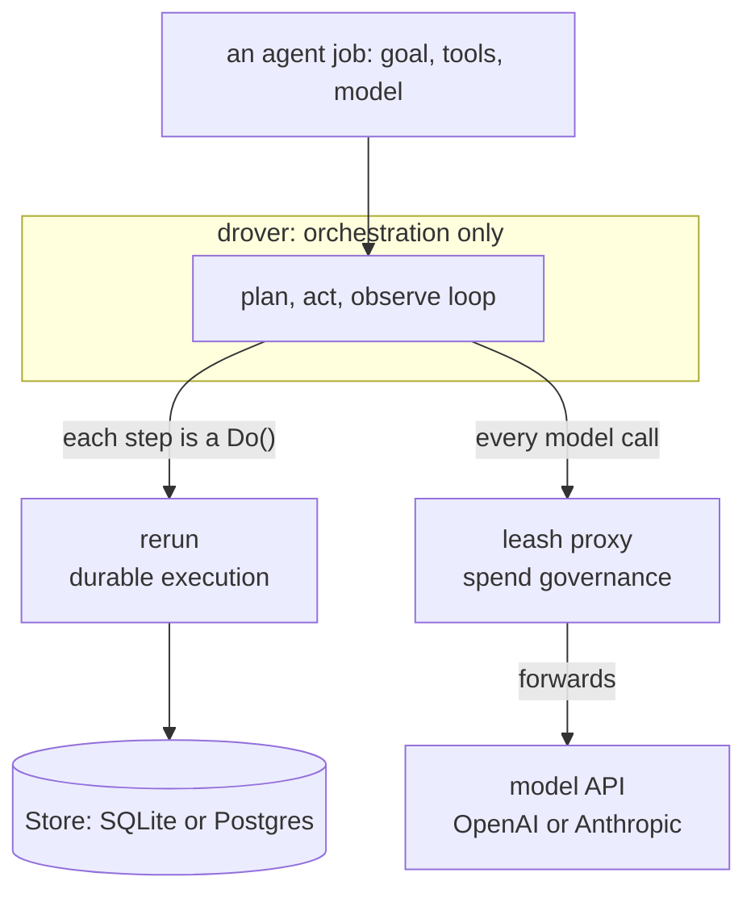

# Design

drover composes two existing systems into a durable, budgeted agent runner. It
adds orchestration and nothing else: [rerun](https://github.com/sylvester-francis/rerun)
owns durability, [leash](https://github.com/sylvester-francis/leash) owns
governance.



## The shape

The agent loop runs as a rerun workflow. Each step is a `Do`, so a crash resumes
at the step that was in flight rather than restarting the job:

```
Do(model)   a completion, routed through the leash proxy
Do(tool)    a tool call, its result folded back into the conversation
... repeat until the model gives a final answer or leash refuses a call
```

Every model call is made against a leash proxy URL, so the whole job runs under a
hard spend budget. When leash trips a boundary, the call comes back refused and the
run ends cleanly. drover re-implements none of that: it points the calls at leash
and lets the boundary do the work.

## Boundaries (what drover does not own)

- **Durability** is rerun's. drover persists no state itself; the workflow journal
  is the source of truth for where a job is. On recovery the conversation is
  refolded from the journal.
- **Governance** is leash's. drover meters and caps nothing; it routes model calls
  through the proxy. This keeps leash's "governs any agent" property intact: drover
  is one durable agent among many that leash can govern, not a special case.
- drover owns only orchestration: turning an agent definition into a rerun
  workflow, wiring the model client at the leash proxy, and surfacing progress.

## How it is built

drover is a small set of public Go packages plus a CLI. Each has one job:

| Package | Owns |
|---|---|
| `agent` | the plan/act/observe loop as a rerun workflow; `Agent`, `Tool`, `Toolset` |
| `model` | provider-agnostic chat and tool types; the `Client` interface |
| `provider` | OpenAI and Anthropic clients plus an offline `Fake`; the leash governor seam |
| `runner` | engine wiring over a rerun `Store`: `Start`, `Recover`, `Wait` |
| `tools` | built-in idempotent tools (`http_get`) |
| `cmd/drover` | the `run` / `resume` / `version` CLI |

The decisions behind the shape are recorded in [`docs/adr/`](docs/adr); the full
data flow and recovery model, with diagrams, are in
[`docs/architecture.md`](docs/architecture.md).

## Two decisions worth stating here

- **Branch on values, not error types.** rerun preserves a step's return value
  across replay but not its error's concrete type, so drover encodes governance
  outcomes (a budget stop, a rate limit) as values on the response and branches on
  those, never on an error type.
  ([ADR-0003](docs/adr/0003-branch-on-values-not-error-types.md))
- **A budget stop is a clean completion.** A leash boundary ends the run `Done`
  with the reason recorded, not `Failed`; the governor doing its job is not an
  agent failure.
  ([ADR-0004](docs/adr/0004-budget-stop-is-a-clean-completion.md))

## Non-goals

- **No persistence of its own.** rerun's journal is the source of truth.
- **No governance of its own.** leash meters and caps spend; drover routes calls.
- **No provider SDK lock-in.** drover speaks to whatever endpoint the leash proxy
  fronts.
- **No config DSL.** Agents are defined in Go, against the `agent` and `model`
  interfaces, not a configuration language.
  ([ADR-0005](docs/adr/0005-framework-in-go-no-config-dsl.md))
