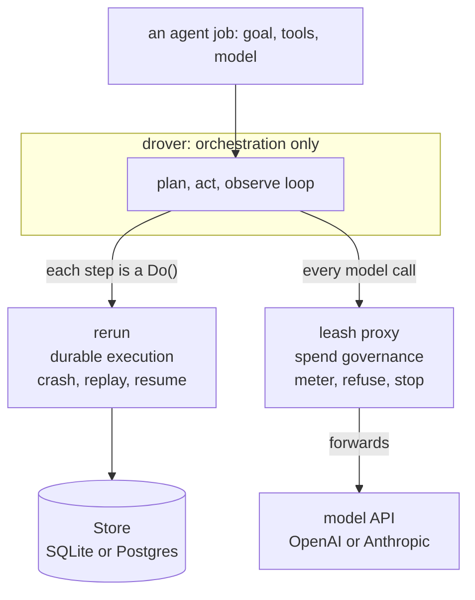
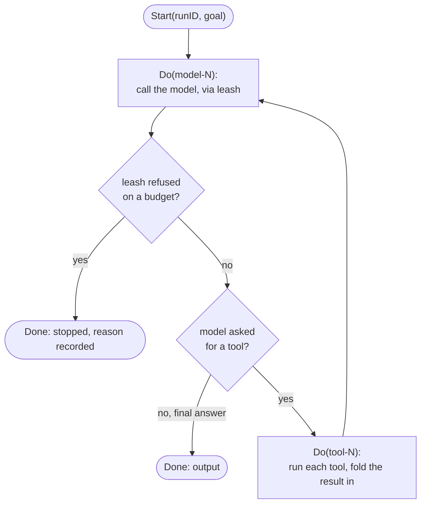
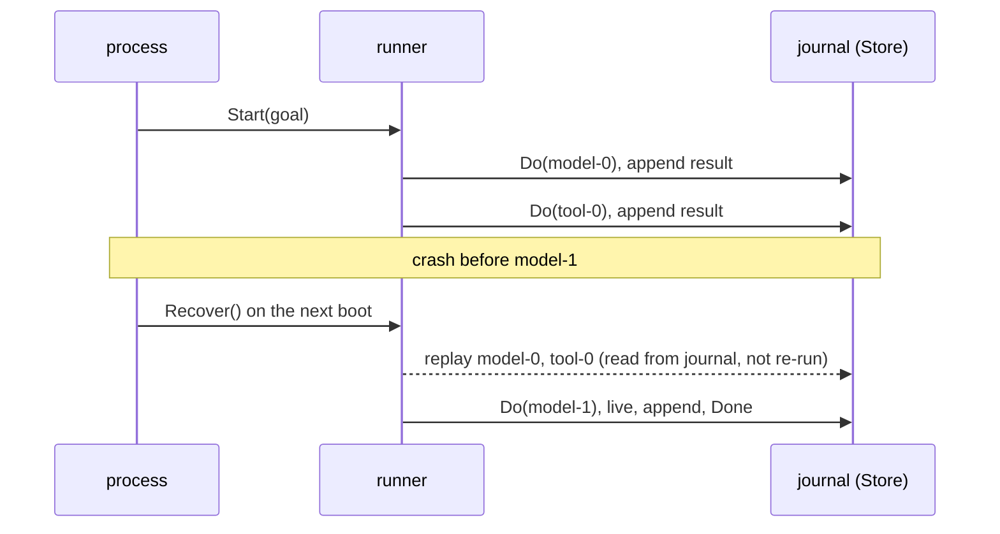
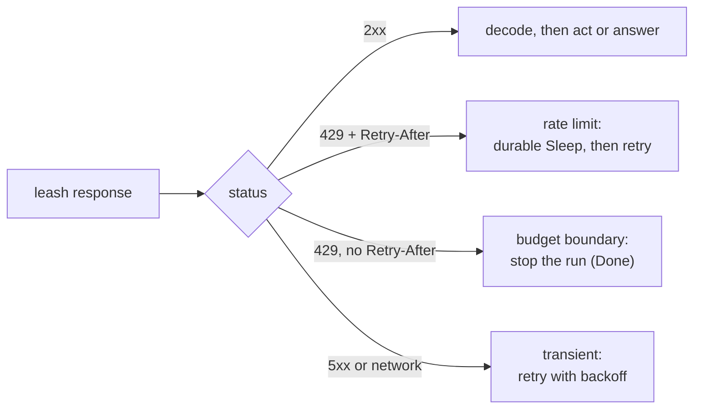
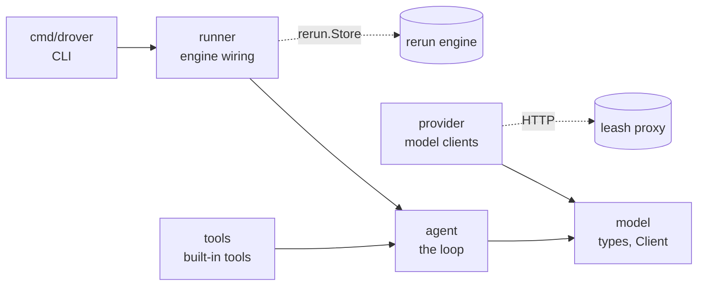

<!--
Copyright 2026 Sylvester Francis
Licensed under the Apache License, Version 2.0. See the LICENSE file.
-->

# Architecture

drover is a durable, budgeted agent runner. It composes two systems and owns only
the orchestration between them: [rerun](https://github.com/sylvester-francis/rerun)
provides durable execution, [leash](https://github.com/sylvester-francis/leash)
provides spend governance. This document is the map: the layers, the data flow, and
how a job survives a crash and a budget.

## The three layers

- **rerun** makes the loop *durable*: every model and tool call is journaled, so a
  crash resumes at the in-flight step instead of restarting the job.
- **leash** makes it *bounded*: every model call goes through the proxy, which
  refuses the call when a spend budget trips.
- **drover** is the thin layer that turns an agent definition into a rerun workflow
  and points its model calls at leash. It stores nothing and governs nothing.

## The durable loop

The loop is a rerun workflow. Each iteration is a model call (a `Do`) and, when the
model asks to act, one `Do` per tool call:

drover holds **no state of its own**. The message history is a local variable
rebuilt from the journaled step results every time the workflow runs, so on
recovery it is refolded to exactly what it was. The journal, not drover, is the
source of truth for where a job is.

## Recovery and replay

If the process dies mid-job, the next `Recover()` re-runs the workflow. Completed
steps return their journaled results without executing; the first step past the end
of the journal runs live:

Because rerun is **at-least-once** for side effects, a tool caught mid-flight by a
crash re-runs on recovery, which is why **every tool must be idempotent**. A
completed tool step, already in the journal, is never re-run. This is proven by a
crash-injection test in `runner`: a fault is injected at the journal-write
boundary, a fresh runner recovers over the same store, and the test asserts the
completed tool step replays without re-running while the un-journaled model step
re-executes.

## The governor seam

drover reads leash's verdict straight off the wire and turns it into a value the
loop branches on. This lives in `provider`, shared by every model client:

The `429`-with-`Retry-After` versus `429`-without distinction is how leash
separates transient backpressure from a terminal stop. A terminal stop finishes the
run `Done` with the reason recorded, not `Failed`, because the governor doing its
job is not an agent failure. The `examples/e2e` demo shows both paths end to end.

## Determinism: branch on values, not error types

rerun matches journaled steps to code by position and tag, so the workflow must be
deterministic. One subtle trap, specific to building on rerun: a step's return
*value* survives replay, but its error's concrete *type* does not. A replayed
failure is always a `*rerun.StepError` carrying the message only. So drover encodes
every control-flow decision (a governor stop, a rate limit) as a **value** on
`model.Response` (`Stopped`, `RetryAfter`) and branches on those, never on an error
type. Branching on `errors.As` or `errors.Is` inside the loop would pass live and
diverge on replay.
(See [ADR-0003](adr/0003-branch-on-values-not-error-types.md).)

## Package structure

Small, public packages, each with one job; dependencies point inward toward
`model`:

| Package | Role |
|---|---|
| `model` | provider-agnostic chat and tool types; the `Client` interface. Governance outcomes ride as values here. |
| `agent` | `Agent`, `Tool`, `Toolset`, and the `Loop`: the plan/act/observe workflow. |
| `provider` | OpenAI and Anthropic clients plus an offline `Fake`; the governor seam (`base.send`). |
| `runner` | wires a `Loop` onto a rerun `Engine` over a `Store`: `Start`, `Recover`, `Wait`, `Result`. |
| `tools` | built-in idempotent tools. |
| `cmd/drover` | the CLI: `run` / `resume` / `version`. |

## What lives where

| Concern | Owner |
|---|---|
| Where a job is (its journal) | rerun `Store` (SQLite or Postgres) |
| Spend and budgets | the leash proxy |
| The conversation, the loop, tool dispatch | drover (`agent`) |
| Talking to a model | drover (`provider`), through leash |

drover's own store is separate from anything leash keeps: drover is just another
durable agent leash governs.

## See also

- [`docs/using-drover.md`](using-drover.md): the how-to guide.
- [`docs/adr/`](adr): the decisions behind the design.
- [`DESIGN.md`](../DESIGN.md): the one-page design contract.
- [`examples/e2e`](../examples/e2e): the whole stack running offline.
